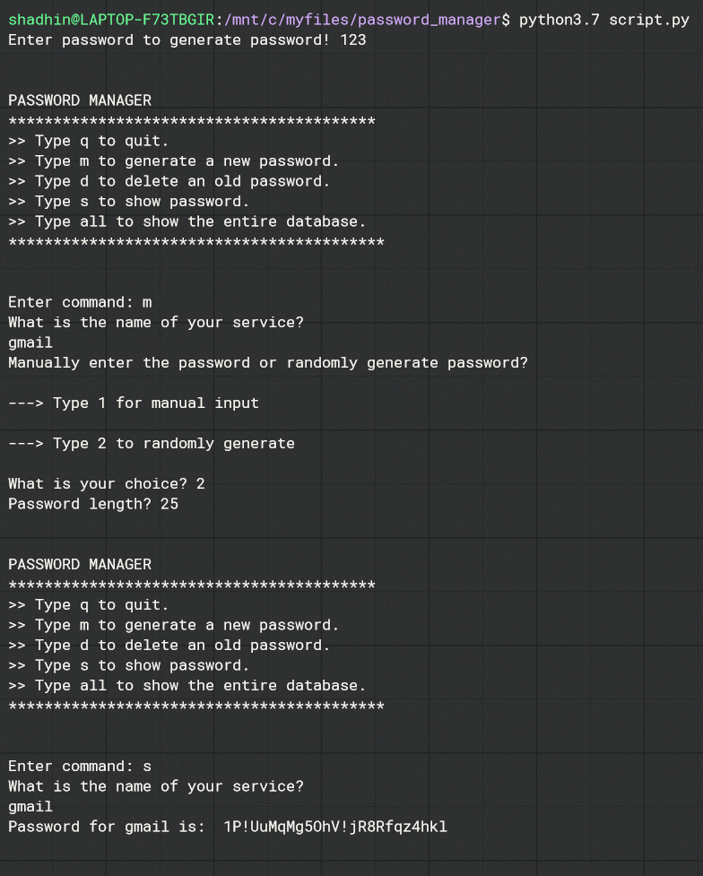

# Password Manager
This is a python program to create secure passwords and manage them properly. Creating new passwords for every account and memorizing them can be very intimidating. Using this program we can either manually create a password or let the program make a password randomly. The program also stores the passwords in a database. So we don't need to memorize every password. Just have one admin password to access the database, and we can access all other passwords from here.
<p> So, the admin password better be very secure. &#128580 </p>

----------------------------------------------------------------------------------------------------------------------------------------
### Built With:
* Python 3.7.7
* sqlite3 2.6.0

----------------------------------------------------------------------------------------------------------------------------------------
### Requirements:
* clone the ripo or download zip
```
https://github.com/FahadulShadhin/Password-Manager.git
```
* Install sqlite3 using pip
```
pip install pysqlite3
```
* cd to project folder and run <strong>script.py</strong>
```
python script.py (for windows)
python3.7 script.py
```
----------------------------------------------------------------------------------------------------------------------------------------
### An Example:
The program looks like this...
<p></p>

----------------------------------------------------------------------------------------------------------------------------------------
